# PocketSom

## Wine Map
#### Wine Prodution/Exports
In the plot of Wine prodution, the plot shows the darkest shade f blue in Europe with Italy, France and Spain all producing over 40 Million Hectoliters of wine per year. the US produces about half of what the France is producing in a year. The top countries that export are positively correlated with how much the countries produce. Italy, France, and Spani are the top Exporters of wine iin the World averaging about 3.5 billion dollars a year.   
#### Consmption/Imports
It would make sense that the countries that produce the most would not import the most. Although those countries are towards the top of the list, North America and China import average of 3 billion dollars of wine a year. It is interesting to note that some of tthe op importers of wine are also the largest consumers of wine with the US being the top consmer of 32.7 Million Hectoliters per year. 
#### Largest Vineyards
France, Italy, and Spain are some of the the top contries that have the most surface area for Vineyards. This can contribute to the countires top prodution.   

## Tasting Metrics & Nutrition Links
* This section shows the average nutritional values and tasting metrics of different types of wine and grapes as well as the correlation between the each tasting metric and the nutrinational values.
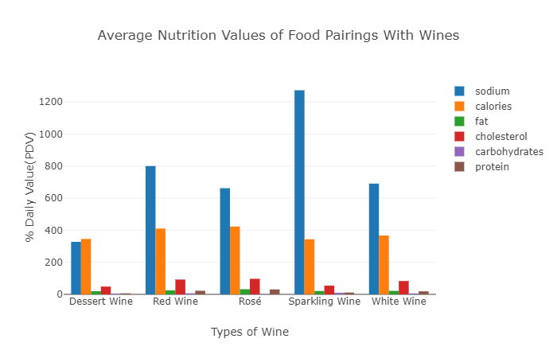
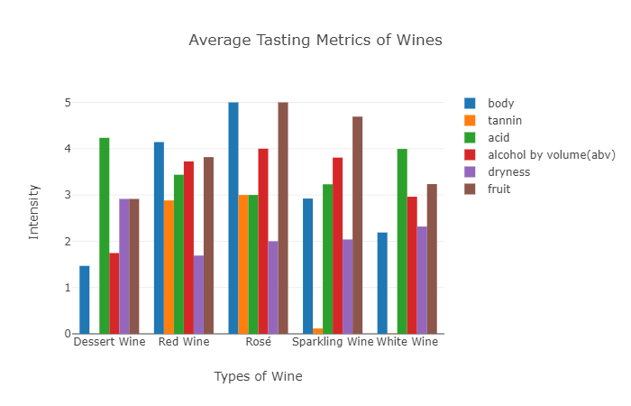
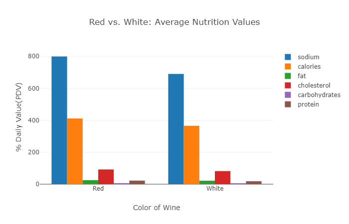
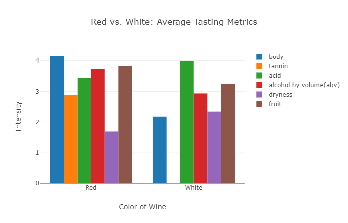
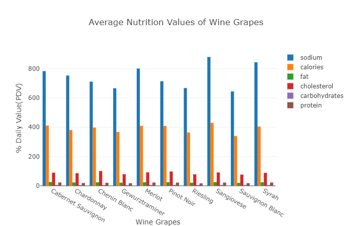
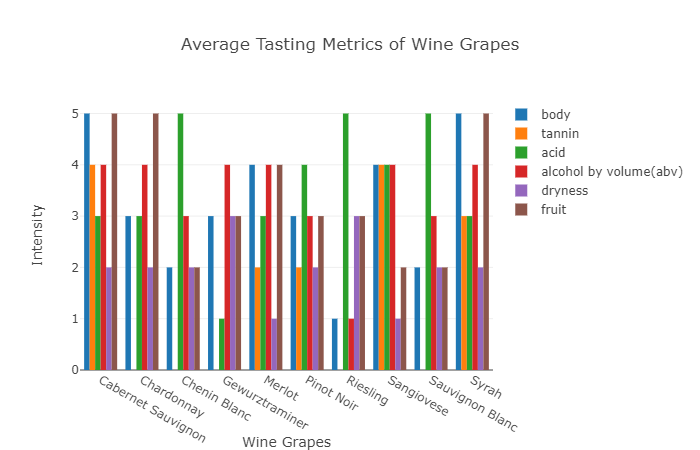
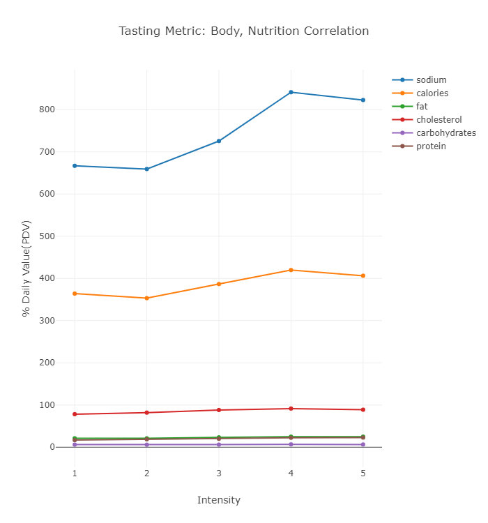
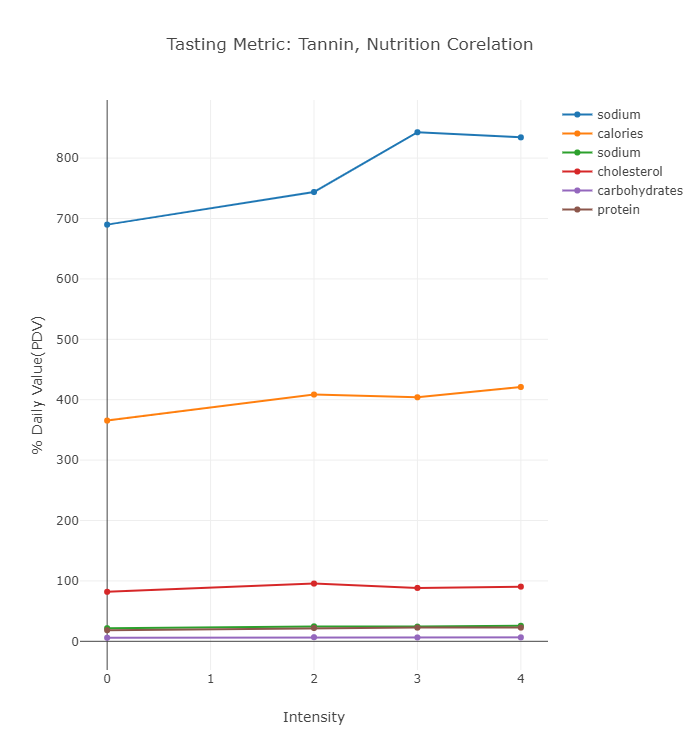
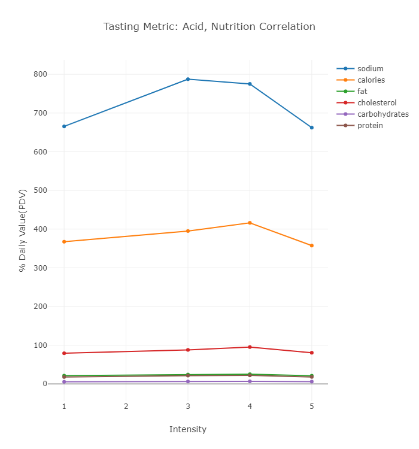
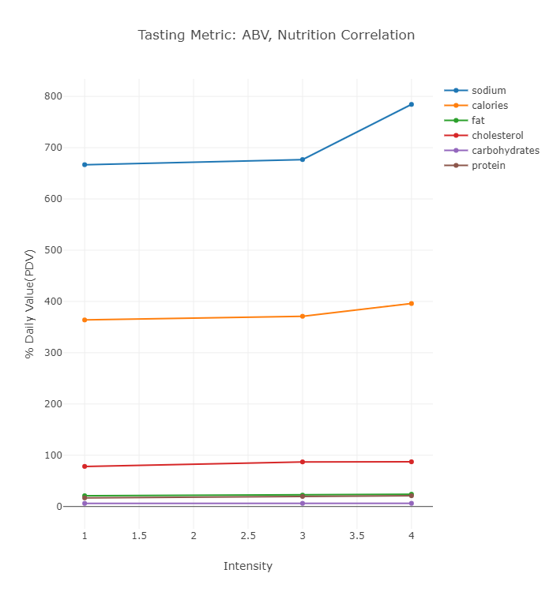
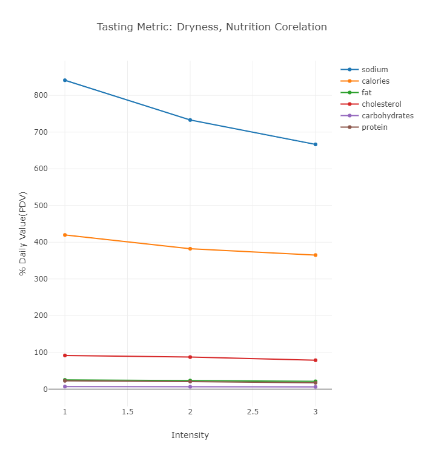
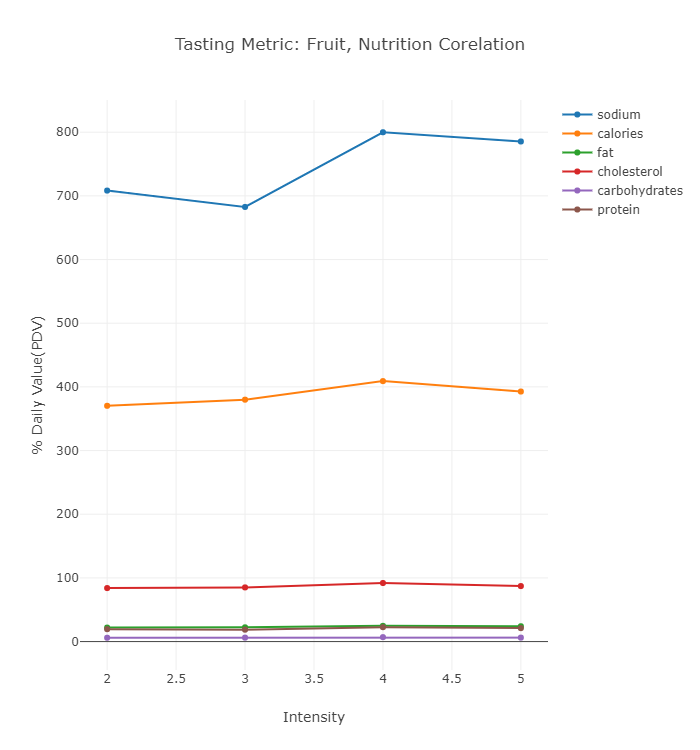
