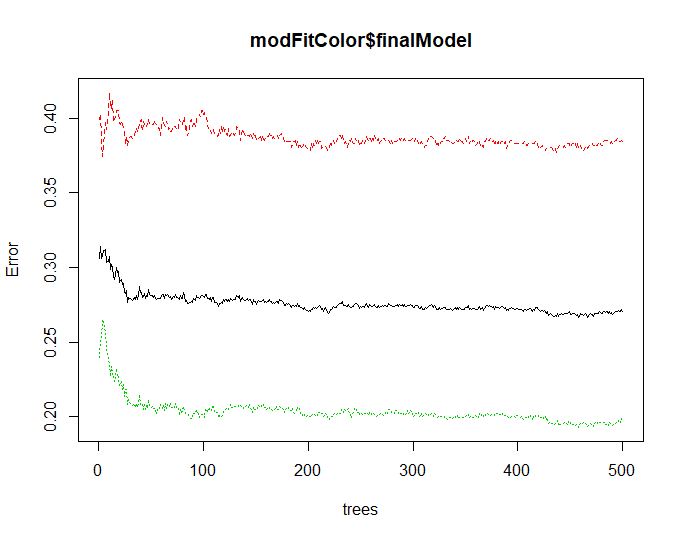

# PocketSom
## Wine Predictions
### Data
For our prediction model we used data from a variety of sources such as kaggle.com and other websites like allrecipes.com.  Our wine pairing data and recipe data that was fed directly into the model was created through scraping thousands of pages and compiling the data into dataframes with pandas in python. 
### Model Building
We began by taking our paired recipes and running a scraper to get ingredients and nutritional values for those recipes which were then tested in a variety of regression and classification models ranging from simple linear regressions to random forest regression and classifications. The model that provided us with the greatest prediction accuracy was the random forrest classification model, with an accuracy of ~86% on the train set and a predictive accuracy of ~76% on the test set. The plot below shows us the prediction error rates as the model went through refining and fitting to the dataset. The green line trend shows the error rate associated with the final model. 

One of the short commings we had in building our model was the size of our dataset. The utilized dataset consisted of about 8,000 rows, so when it was being partitioned into test and train sets the resulting subsets were at most about 6,000 rows. This smaller subset of data meant our model would be more susceptible to outliers and variations in each nutritional category and thus would ultimately hinder the predictive accuracy.
## Wine Map
#### Wine Prodution/Exports
In the plot of Wine prodution, the plot shows the darkest shade f blue in Europe with Italy, France and Spain all producing over 40 Million Hectoliters of wine per year. the US produces about half of what the France is producing in a year. The top countries that export are positively correlated with how much the countries produce. Italy, France, and Spani are the top Exporters of wine iin the World averaging about 3.5 billion dollars a year.   
#### Consmption/Imports
It would make sense that the countries that produce the most would not import the most. Although those countries are towards the top of the list, North America and China import average of 3 billion dollars of wine a year. It is interesting to note that some of tthe op importers of wine are also the largest consumers of wine with the US being the top consmer of 32.7 Million Hectoliters per year. 
#### Largest Vineyards
France, Italy, and Spain are some of the the top contries that have the most surface area for Vineyards. This can contribute to the countires top prodution.   

## Tasting Metrics & Nutrition Links
* This section shows the average nutritional values and tasting metrics of different types of wine and grapes as well as the correlation between the each tasting metric and the nutrinational values.

